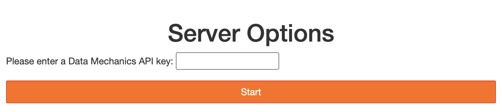
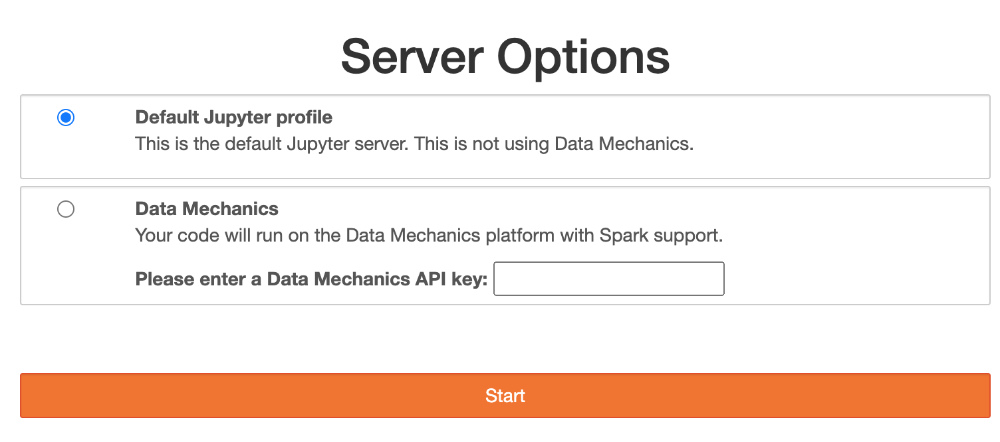

# Data Mechanics / JupyterHub integration example

This is an example integration of the DataMechanics platform in JupyterHub.

WARNING: this is for educational purposes only. The JupyterHub installation
will give unauthenticated access to your cluster.

If you have an existing JupyterHub setup and wish to add Data Mechanics support to it,
please check out the YAML configuration files and cherry-pick the configurations
that makes sense in your case.
More information below!

## Single user or profile

There are two ways to install Data Mechanics on JupyterHub: as single user or as a profile.

### As a single user

All notebook servers launched by Jupyter Hub will launch notebook kernels on Data Mechanics.
Users will be asked to provide a Data Mechanics API key everytime they launch a notebook server.

This setup is useful if your JupyterHub instance is dedicated to Data Mechanics.

Please check out `config-singleuser.yaml`.



### As a profile

Users will be asked to choose a notebook server profile from a list.
The list can be configured from the JupyterHub configuration. The user will be asked for a Data Mechanics API key only if they choose a Data Mechanics notebook server profile.

This setup is useful if you already have a JupyterHub instance and want to add Data Mechanics support to it while preserving the ability to run pure Python notebooks.

Please check out `config-profiles.yaml`.



## Install prerequesites

- [helm](https://helm.sh/)
- A working Kubernetes cluster

## Generate an API key

Navigate to your DataMechanics control plane, and generate an API key.

## Install JupyterHub on your cluster

```shell
$ make install-singluser
```
or
```shell
$ make install-profiles
```

## Try your JupyterHub installation

Retrieve the public IP of your JupyterHub:

```shell
$ kubectl get service --namespace jupyterhub
NAME           TYPE           CLUSTER-IP       EXTERNAL-IP     PORT(S)        AGE
hub            ClusterIP      172.20.142.143   <none>          8081/TCP       7h46m
proxy-api      ClusterIP      172.20.29.114    <none>          8001/TCP       7h46m
proxy-public   LoadBalancer   172.20.234.80    <THE_PUBLIC_IP> 80:31789/TCP   7h46m
```

Navigate to https://\<THE_PUBLIC_IP\>/, put the address of your DataMechanics
control plane (suffixed with `/notebooks`), and the API key you generated.

Start a notebook and check its status in your DataMechanics control plane.
